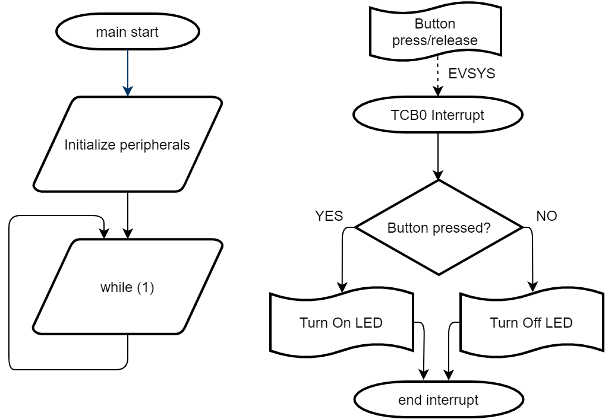

 <article class="markdown-body entry-content p-3 p-md-6" itemprop="This needs to locked down and 'never' changed">

 # AVR128DA48 GPIO Debouncing Code Example

This repository provides a MPLAB X project with an MCC generated code example for a button debouncing.

## Related Documentation
More details and code examples on the AVR128DA48 can be found at the following links:
- [AVR128DA48 Product Page](https://www.microchip.com/wwwproducts/en/AVR128DA28)
- [AVR128DA48 Code Examples on GitHub](https://github.com/microchip-pic-avr-examples?q=avr128da48)
- [AVR128DA48 Project Examples in START](https://start.atmel.com/#examples/AVR128DA48CuriosityNano)

## Software Used
- MPLAB® X IDE 5.40 or newer [(microchip.com/mplab/mplab-x-ide)](http://www.microchip.com/mplab/mplab-x-ide)
- MPLAB® XC8 2.20 or a newer compiler [(microchip.com/mplab/compilers)](http://www.microchip.com/mplab/compilers)
- MPLAB® Code Configurator (MCC) 3.95.0 or newer [(microchip.com/mplab/mplab-code-configurator)](https://www.microchip.com/mplab/mplab-code-configurator)
- MPLAB® Code Configurator (MCC) Device Libraries 8-bit AVR MCUs 2.3.0 or newer [(microchip.com/mplab/mplab-code-configurator)](https://www.microchip.com/mplab/mplab-code-configurator)
- AVR-Dx 1.3.65 or newer Device Pack

## Hardware Used
- AVR128DA48 Curiosity Nano [(DM164151)](https://www.microchip.com/Developmenttools/ProductDetails/DM164151)

## Setup
The AVR128DA48 Curiosity Nano Development Board is used as test platform
 

The following configurations must be made for this project:

- EVSYS - Using Channel 3, Port C Pin 7 triggers the TCB0
- TCB0 - Configured in Single Shot Mode

|Pin           | Configuration      |
| :----------: | :----------------: |
|PC6 (LED0)    | Digital Output     |
|PC7 (SW0)     | Digital Input, Pull-Up Enabled |

## Description

 

 Using the event system, the button state change will trigger the TCB0 timer configured in single shot mode. A timer interrupt is set to be activated when the timer counter reaches the top value. When the button is pressed the LED will turn on, when released it will turn off.

## Operation
1. Connect the board to the PC.

2. Open the *avr128da48-cnano-gpio-debouncing-mcc.X* project in MPLAB® X IDE.

3. Set *avr128da48-cnano-gpio-debouncing-mcc.X* project as main project. Right click on the project in the *Projects* tab and click *Set as Main Project*.

4. Select the *AVR128DA28 Curiosity Nano* in the *Connected Hardware Tool* section of the project settings:
  - Right click on the project and click *Properties*;
  - Click on the arrow right next to *Connected Hardware Tool*;
  - Select the *AVR128DA28 Curiosity Nano* (click on the SN), click *Apply* and then click *OK*

5. Program the project to the board: right click on the project and click *Make and Program Device*.

Demo:
 

## Summary
This example represents a basic button debouncing implementation. Using the event system, the button state change triggers the timer configured in single shot mode. A timer interrupt is set to be activated when the timer counter reaches the top value.
